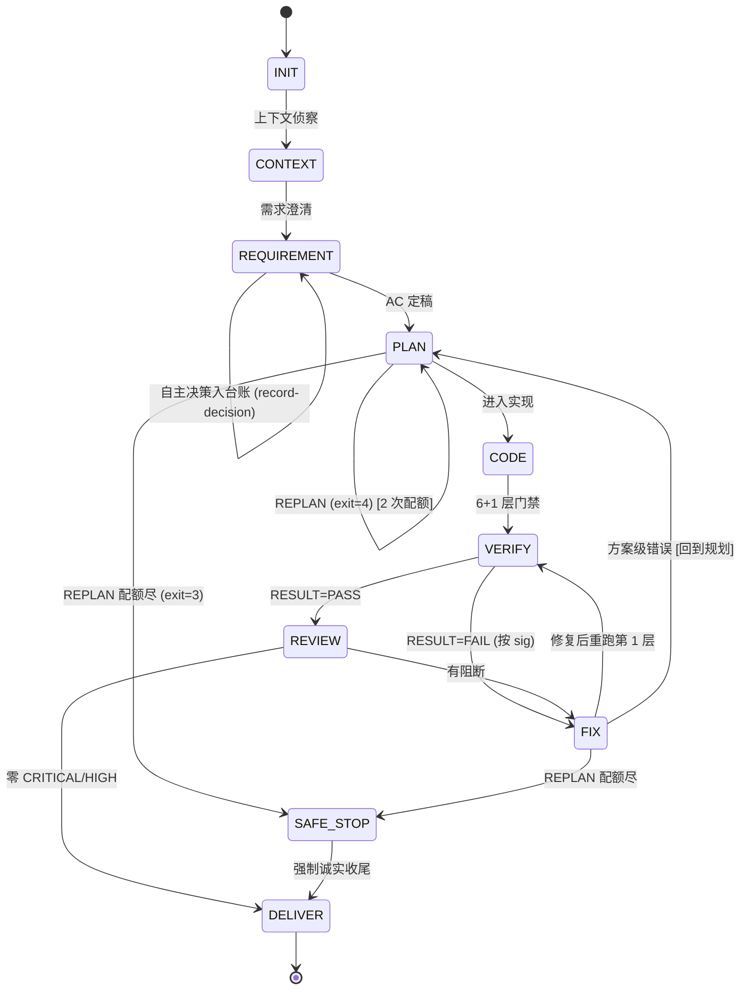
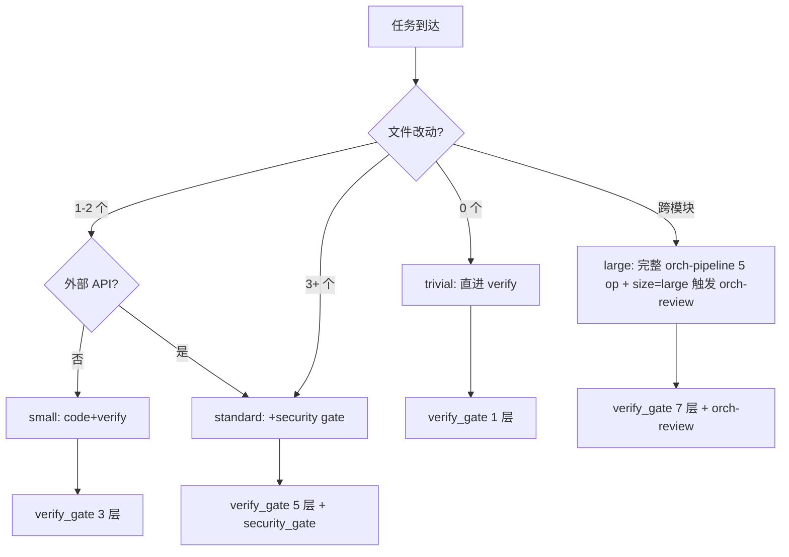

# loop-orchestrator — SPEC

> 段 1 文档。设计未签字前不写段 2 实现。

## 1. 取舍矩阵

每条取舍：现状（ai-coding-loop / ECC 各自）→ 改后 → 理由 → 证据（`file_path:line`）。

| # | 维度 | 现状 | 改后 | 理由 | 证据 |
|---|---|---|---|---|---|
| T1 | 状态机 | ai-coding-loop: `[.claude/skills/loop-control/scripts/loop_state.py](.claude/skills/loop-control/scripts/loop_state.py)` 10 子命令 | fork + 加 `set-size` / `rebuild-capabilities` 子命令；写入改原子 | 保留硬门禁 + 引入 size 维度 | T1: state.json schema 在 [`.ai/loop/state.json`](.ai/loop/state.json)；TRANSITIONS 表在 `loop_state.py:25-36` |
| T2 | verify-gate | ai-coding-loop: `[verify.sh](.claude/skills/verify-gate/scripts/verify.sh)` 5 层 + diff 纯净块 | fork + 加 `CMD_SIZE_CLASSIFY`（lint 前）+ `CMD_SECURITY_GATE`（trigger 命中时） | ECC `orch-review` 的 fail-closed 思路落到 verify 拦截层 | T2: `verify.sh:56-61` 现有 5 层；`[orch-review.workflow.js:58-59](ECC-main/workflows/orch-review.workflow.js)` 的 security regex |
| T3 | ECC subagent 可发现 | 困在 `ECC-main/agents/`，wrapper session 不可见 | mini-installer 复制 8 个到 `wrapper/.claude/agents/`，加 `ecc-` 前缀 | Risk #1 缓解；不允许破坏 wrapper 原 15 agent | T3: harness 加载规则见 Phase 1 Report 3 §I.1；命名冲突见 [AGENTS.md](./AGENTS.md) §R |
| T4 | 路由壳 | 无 | `loop-orchestrator/agents/*.md` 15 个新，body 顶部加"优先委派 ECC，回退原行为" | harness 加载 vs 行为 fallback 双保险 | T4: plan §段 2 文件清单 Agent 层 |
| T5 | hooks 物理位置 | `[settings.json:1-57](.claude/settings.json)` 5 个 hook 内联 bash | 拆到 `loop-orchestrator/hooks/{PreToolUse,PostToolUse,Stop}.json`，settings.json 引用 | 避免 settings.json 变 200 行内联 blob | T5: `settings.json:20` 的 1 个 PreToolUse 已含 heredoc 内嵌 grep |
| T6 | commands.env | 5 变量（LINT/TEST/PROJECT_GATE/FMT/TYPECHECK） | 保留 + 新增 `CMD_SIZE_CLASSIFY` + `CMD_CAPABILITY_REBUILD` | ECC 的 size classifier 命令 + capability cache 失效重扫 | T6: `[.ai/loop/commands.env](.ai/loop/commands.env)` 现状 |
| T7 | state.json | `[.ai/loop/state.json:1-21](.ai/loop/state.json)` 11 字段 | 加 `ecc_review` 子对象 + `capabilities_cache_hash` | 保留 baseline + decisions 原意；review 产物独立存 | T7: state.schema.json 在 [state.schema.json](./state.schema.json) |
| T8 | ECC_BASELINE.json | `[ECC-main/ECC_BASELINE.json:1-401](ECC-main/ECC_BASELINE.json)` 是资源数量 baseline | **不合并**——语义不同 | baseline.passed/failed/total 是测试结果，ECC_BASELINE 是 skill/agent 清单 | T8: `ECC_BASELINE.json:1-19` 头注释明示 |
| T9 | size classifier | ECC `[orch-pipeline SKILL.md:39-54](ECC-main/skills/orch-pipeline/SKILL.md)` 有 4 档（trivial/small/standard/large） | 转译为静态规则 `size-classify.js`（不动 LLM） | MVP 阶段避免 LLM 判定开销 | T9: orch-pipeline §Step 0 |
| T10 | hooks profile gate | ECC `[run-with-flags.js:14-69](ECC-main/scripts/hooks/run-with-flags.js)` 有 env-gate | 借鉴思路，**不**直接 import ECC（避免产品依赖） | 自包含原则 | T10: `hook-flags.js:57-69` 的 gate 逻辑 |

## 2. 状态机（Mermaid）

**size classifier 路径决策**（CONTEXT 阶段后）：

## 3. 15 Agent 路由表（摘要，见 [ROUTING.md](./ROUTING.md) 全文）

| # | ai-coding-loop agent | 委派 ECC subagent（加 `ecc-` 前缀） | 是否物理复制 | fallback |
|---|---|---|---|---|
| 1 | orchestrator | `ecc-orch-pipeline`（skill 层） | ✗ | 直接调 `loop_state.py` |
| 2 | context-scout | `ecc-repo-mapping` + `ecc-code-explorer` | ✓ | 原 repo-mapping skill |
| 3 | requirement-clarifier | `ecc-clarifying-questions` | ✓ | 原 ai-coding-loop skill |
| 4 | requirement-analyst | `ecc-requirement-to-ac` | ✓ | 原 skill |
| 5 | solution-architect | `ecc-planner` + `ecc-architect` | ✓ | 原 impact-analysis skill |
| 6 | feature-coder | `ecc-tdd-guide` + `ecc-feature-coder` | ✓ | 原 convention-mining |
| 7 | modification-surgeon | `ecc-modification-surgeon`（wrapper 新建） | ✗ | 原 contract-sync |
| 8 | unit-test-engineer | `ecc-unit-test-engineer`（wrapper 新建） | ✗ | 原 test-authoring |
| 9 | integration-test-engineer | `ecc-e2e-runner` + `ecc-integration-test-engineer` | ✓ | 原 integration-e2e |
| 10 | regression-guard | `ecc-regression-guard`（wrapper 新建） | ✗ | 原 verify-gate |
| 11 | security-auditor | `ecc-security-reviewer` + `ecc-security-scan` | ✓ | 原 security-sweep |
| 12 | perf-auditor | `ecc-perf-auditor`（wrapper 新建） | ✗ | 原 perf-quantify |
| 13 | code-reviewer | `ecc-code-reviewer` + 23 个语言 reviewer 中按栈选 | ✓ | 原 self-review |
| 14 | fixer | `ecc-fixer` + `ecc-build-fix` | ✓ | 原 fix-with-rca |
| 15 | delivery-reporter | `ecc-delivery-reporter`（wrapper 新建） | ✗ | 原 delivery-report |

**"物理复制"标记**：✓ = mini-installer 会从 `ECC-main/` 复制到 `.claude/agents/`，加 `ecc-` 前缀；✗ = 不复制，由 router shell 在 frontmatter 里写"参考 ECC 资源 N/A 时跳过委派"

## 4. commands.env / state.json 字段

详见 [commands.env.schema](./commands.env.schema) 与 [state.schema.json](./state.schema.json)。

## 5. hooks 行为表

| 事件 | matcher | 命令 | 来源 | 段 2 新位置 |
|---|---|---|---|---|
| PostToolUse | Edit\|Write\|MultiEdit | `bash -c 'source .ai/loop/commands.env ...'` 跑 lint | [settings.json:5-12](.claude/settings.json) | [hooks/PostToolUse.json](./hooks/PostToolUse.json) |
| PreToolUse | Bash | grep `git push\|--force\|rm -rf` → deny | [settings.json:14-23](.claude/settings.json) | [hooks/PreToolUse.json](./hooks/PreToolUse.json) #1 |
| PreToolUse | Edit\|Write\|MultiEdit | grep `.ai/loop/(state.json\|commands.env)` → deny | [settings.json:25-35](.claude/settings.json) | [hooks/PreToolUse.json](./hooks/PreToolUse.json) #2 |
| PreToolUse | Edit\|Write\|MultiEdit | grep `eslint-disable\|...\|noqa` 抑制标记 → deny | [settings.json:37-44](.claude/settings.json) | [hooks/PreToolUse.json](./hooks/PreToolUse.json) #3 |
| Stop | * | `bash .claude/_runtime_python.sh .claude/skills/loop-control/scripts/loop_state.py get` | [settings.json:46-55](.claude/settings.json) | [hooks/Stop.json](./hooks/Stop.json) |

段 2 拆分后，`settings.json` 变为只引用 3 个 JSON 文件的 ~30 行内联 bash，避免变 200 行 blob。
